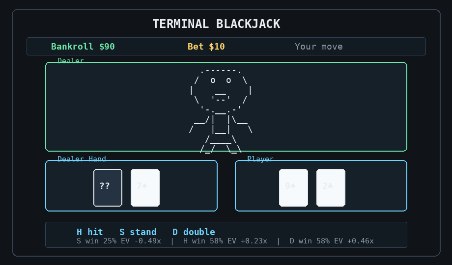

# Terminal Blackjack

A polished terminal blackjack game built with Python and Rich.



## Features

- ASCII dealer and stable terminal table layout
- One-line card whoosh animation in interactive terminals
- Single-key actions during play
- Double and split support
- Auto-stand when a hand reaches `21`
- Live win/push/lose and expected-value estimates for available actions
- Built-in unit tests for blackjack scoring and round results

## Download

If this project is on GitHub:

1. Click the green **Code** button.
2. Choose **Download ZIP**.
3. Unzip the folder.
4. Open a terminal inside the project folder.

Or clone it with Git:

```bash
git clone <repo-url>
cd terminalBlackjack
```

Replace `<repo-url>` with the GitHub URL for this project.

## Requirements

- Python `3.10` or newer
- A terminal that supports ANSI output

Install the Python dependency:

```bash
python3 -m pip install -r requirements.txt
```

If `pip` is unavailable, bootstrap it first:

```bash
python3 -m ensurepip --user
python3 -m pip install -r requirements.txt
```

## Run

```bash
python3 blackjack.py
```

## Controls

- `h` hit
- `s` stand
- `d` double, when you have enough bankroll
- `q` split, when your first two cards match

During your turn, action keys happen immediately without pressing Enter.
At the bet prompt, type an amount or `q` to quit.

## Odds Display

The bottom bar shows live estimates for the current decision:

- `win`: chance that action eventually wins the hand
- `push`: chance the hand ties
- `lose`: chance the hand loses
- `EV`: expected value in bet units

The estimates use your active hand, the dealer up-card, and the unseen deck.
The dealer hidden card is treated as unknown.

## Rules

- You start with `$100`.
- Bet between `$1` and your current bankroll.
- Dealer hits until `17` and stands on all `17`s, including soft `17`.
- Your hand automatically stands when it reaches `21`.
- Natural blackjack pays `3:2`.
- Normal wins pay `1:1`.
- Push returns the bet.
- The game ends when you quit or run out of chips.

## Tests

```bash
python3 -m unittest discover -s tests -v
```

## Regenerate The Demo GIF

The checked-in demo lives at `assets/demo.gif`. To regenerate it, install
Pillow and run:

```bash
python3 -m pip install pillow
python3 scripts/create_demo_gif.py
```
